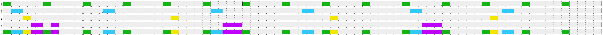
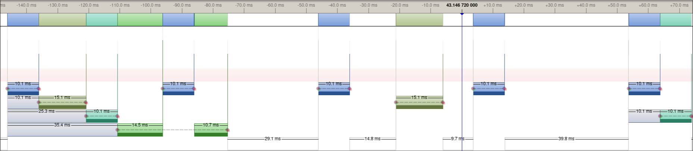

# Car Simulator

## Phase A

### Periodic Tasks

| Task | Function | WCET [ms] | Period [ms] | Phase | Priority (RMA) |
| :--- | :--- | :---: | :---: | :---: | :--- |
| **Engine** | Performs car engine checks periodically | 10 | 50 | 0 | 1 (Highest) |
| **Display** | Displays car information | 15 | 125 | 0 | 2 |
| **Tire** | Performs tire pressure checks | 10 | 200 | 0 | 3 |
| **Rain** | Performs rain detection | 25 | 250 | 0 | 4 (Lowest) |

### Schedulability

We will be using the RMA scheduling algorithm.

#### Total utilization

| Task | $C_i$ (WCET) | $T_i$ (Period) | $U_i = C_i / T_i$ |
| :--- | :---: | :---: | :---: |
| **Engine** | 10 ms | 50 ms | 0.20 |
| **Display** | 15 ms | 125 ms | 0.12 |
| **Tire** | 10 ms | 200 ms | 0.05 |
| **Rain** | 25 ms | 250 ms | 0.10 |
| **Total Utilization ($U$)** | | | **0.47** |

#### Sufficient Condition

The Sufficient Condition (Liu & Layland Bound) for a set of $n$ tasks is defined as:

$$U = \sum_{i=1}^{n} \frac{C_i}{T_i} \le n(2^{1/n} - 1)$$

For $n = 4$:

$$0.47 \le 4(2^{1/4} - 1) \approx 0.756$$

Since $0.47 \le 0.756$, the task set is guaranteed to be schedulable under RMA.


### Simulator

The config of the simulator can be found [here](./doc/simulator/configuration_phase_a.json)

And here is the screenshot : 

As expected, all the tasks can be executed within their contrains. This prove once more that all the tasks should be schedulable using the RMA algorithm.

### Dynamic simulation

Now, it is time to test the tasks scheduling on the nordic board.

Here is the screen shot of the system view : 

As we can see, this is exactly the same as the simulated screenshot.

Then, we can run the stastical analysis on the export data. And we get that all markers respect the constrain : 

```bash
❯ uv run ./scripts/csv_parser.py ./car_sim/doc/dynamic/data.csv --marker 0 --period-ms 50 --tolerance-ms 0.2 --marker 1 --period-ms 125 --tolerance-ms 0.2 --marker 2 --period-ms 200 --tolerance-ms 0.2 --marker 3 --period-ms 250 --tolerance-ms 0.2
Parsing ./car_sim/doc/dynamic/data.csv ...
Found 366 marker event(s)

============================================================
Marker 0  (0x00000000)
------------------------------------------------------------
  Periods  (Start to Start):
    n=98  mean=50.000561ms  min=49.957275ms  max=50.048828ms  std=0.020413ms
  Durations (Start to Stop):
    n=98  mean=10.079832ms  min=10.070800ms  max=10.192871ms  std=0.018086ms
  Validation:
  Period check  : 98/98 within 50.000ms ± 0.200ms
  PASS  Marker 0

============================================================
Marker 1  (0x00000001)
------------------------------------------------------------
  Periods  (Start to Start):
    n=39  mean=125.000782ms  min=124.938965ms  max=125.061035ms  std=0.022380ms
  Durations (Start to Stop):
    n=39  mean=20.070394ms  min=15.106201ms  max=25.421143ms  std=5.079139ms
  Validation:
  Period check  : 39/39 within 125.000ms ± 0.200ms
  PASS  Marker 1

============================================================
Marker 2  (0x00000002)
------------------------------------------------------------
  Periods  (Start to Start):
    n=24  mean=200.002035ms  min=199.951172ms  max=200.073242ms  std=0.024393ms
  Durations (Start to Stop):
    n=25  mean=15.152588ms  min=10.070800ms  max=35.430908ms  std=10.139169ms
  Validation:
  Period check  : 24/24 within 200.000ms ± 0.200ms
  PASS  Marker 2

============================================================
Marker 3  (0x00000003)
------------------------------------------------------------
  Periods  (Start to Start):
    n=19  mean=250.001606ms  min=249.938965ms  max=250.061035ms  std=0.020942ms
  Durations (Start to Stop):
    n=20  mean=35.343934ms  min=35.339356ms  max=35.369873ms  std=0.010897ms
  Validation:
  Period check  : 19/19 within 250.000ms ± 0.200ms
  PASS  Marker 3

============================================================
PASS  All markers within timing constraints
```

As we can see from this quick summary. All the markers respects the constrain within 0.02 ms of tolerance at most.
